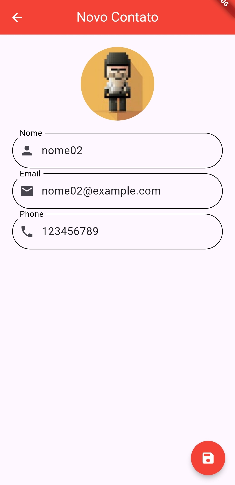
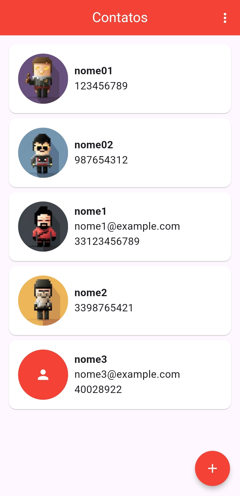
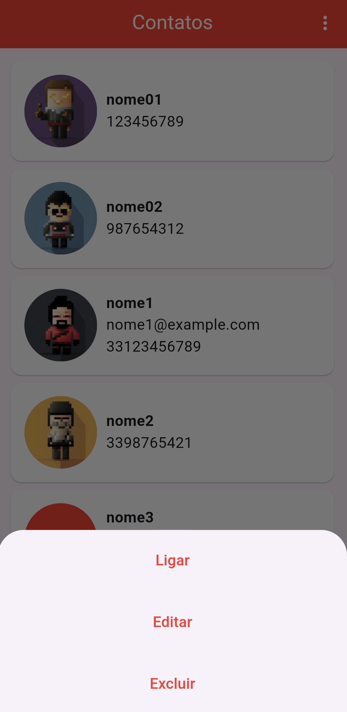

# App Agenda de Contatos    

## Descrição
Este é um aplicativo Flutter para administrar um agenda de contatos. Ele permite que sejam criados contatos adicionando seu nome, email, número do celular e uma foto tirada no momento ou da galeria. Esse projeto foi feito com objeto de praticar e aprimorar habilidades no uso do Flutter.

## Capturas de Tela
<div>
    
    
    
</div>

## Instruções de Uso
1. Abra o aplicativo.
2. Use o Botão flutuante para adicionar um contato.
3. Preencha os Campos necessários como nome e telefone, caso queria adicione uma foto ou o e-mail do contato.
3. Salve o contato.
4. Ao clicar em um contato é possível ligar, editar ou excluir o contato.

## Instalação via APK
Baixe o APK disponível na seção de Realeases.

## Instruções de Instalação
1. Clone o repositório:
   ```bash
   git clone https://github.com/ManuelFerreira90/app_agenda_de_contatos.git
   cd app_agenda_de_contatos
   flutter pub get
2. Execute o aplicativo
   ```bash
   flutter run
   ```
obs: tenha um dispostivo android conectado em modo depuração usb.

## Tecnologias Usadas
- Flutter
- Dart

